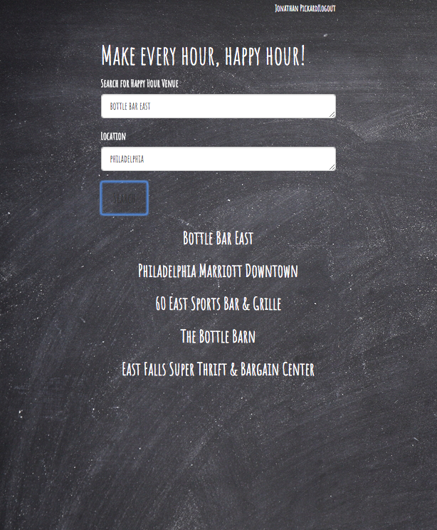
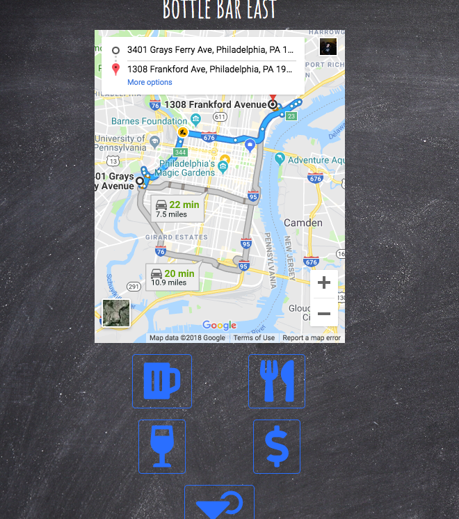
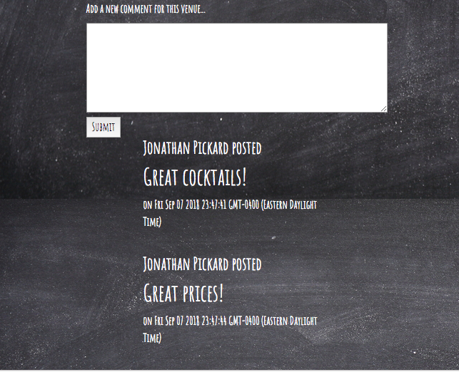

<h1>Happiest Hour App</h1>

<h2>What is it?</h2>
A full stack development project utilizing the MVC design pattern. Happiest Hour is the app you wish you had! Using Facebook login verification and MySQL to store comments, our app provides the user with up to date crowdsourced information on happy hours nearby. 
The straightforward UI makes it an easy to use mobile forum for local bars. Includes maps that show you how to get to the bar you need to be at. Includes every bar with a FourSquare venue id.

<h2>Built With</h2>
<ul>
  <li>Express</li>
  <li>Handlebars</li>
  <li>CSS</li>
  <li>Bootstrap</li>
  <li>JavaScript</li>
  <li>jQuery</li>
  <li>Node.js</li>
  <li>MySQL</li>
  <li>MAMP</li>
  <li>Google Fonts</li>
  <li>Font Awesome</li>
  <li>AJAX</li>
  <li>Facebook API</li>
  <li>Passport</li>
  <li>FourSquare API</li>
  <li>Geocoder</li>
  <li>Google Maps API</li>
</ul>

<h2>How does it work?</h2>
When you arrive on the landing page, click Login with Facebook to verify your identify. Then, you can search using the name of the bar and the location of your choosing. The search will come back with the top 5 hits. 
Click on the bar you want to learn more about to get visit the bar's page, where you will see an embedded map with directions to the bar as well as a list of comments added by other users. From here, you can add your own comments. Help your fellow drinkers by providing up to date information about food and drink specials at the bars you visit!

<h2>Demo</h2>
https://www.useloom.com/share/b6836fc91b154d1399a2f21101e63513

<h2>Future Development Goals</h2>
<ul>
  <li>Image hosting</li>
  <li>Ride share functionality</li>
  <li>Up and downvote functionality for comments</li>
  <li>Social interaction on Facebook</li>
  <li>Route planning/Pub crawl</li>
  <li>Single sign on geolocation</li>
  <li>Filter specials</li>
  <li>One touch icons displayed on map</li>
 </ul>

<h2>Check us out on Heroku! Cheers!</h2>
https://evening-taiga-20348.herokuapp.com/

